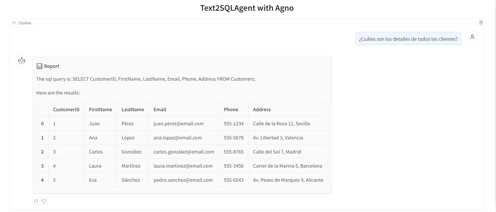

# SQL Database Explorer with Open Source LLMs

An interactive tool for exploring SQL databases using natural language queries powered by open-source LLMs through [Ollama](https://ollama.com/).

## Features

- **Dynamic Database Discovery**: Automatically finds and connects to all SQLite databases in the data directory
- **Dynamic Model Selection**: Automatically detects all available Ollama models and allows switching between them
- **Flexible Ollama Integration**: Supports both local and remote Ollama instances with easy switching
- **Natural Language Queries**: Ask questions about your data in plain English
- **Interactive UI**: Switch between databases and models through a simple web interface
- **Command System**: Use commands like `/list_db`, `/db [name]`, `/list_models`, `/model [name]`, and `/schema` to interact with the system
- **Remote Ollama Support**: Connect to remote Ollama instances using the OLLAMA_HOST environment variable
- **Session Persistence**: Automatically saves and recovers session state if disconnections occur

## ◻️ Data 

The application works with any SQLite database files placed in the `app/data` directory. Sample databases include:

- `shop.db`: An e-commerce database with customers, products, orders, and order details
- `inventory.db`: An inventory management database with stock and orders information

You can add your own SQLite databases to the data directory, and they will be automatically discovered.

## Technologies

* [Python](https://www.python.org/)
* [uv](https://docs.astral.sh/uv/) - Fast Python package installer and resolver
* [Ollama](https://ollama.com/library/qwen2.5-coder) - Local LLM server
* [Agno](https://docs.agno.com/) - Minimalist framework for interacting with LLMs
* [SQLite](https://database.guide/category/dbms/rdbms/sqlite/) - Lightweight database engine
* [Gradio](https://gradio.app/) - Web interface framework

## ◻️ Setup 

◽  **Step 1** Install [uv](https://docs.astral.sh/uv/getting-started/installation/#standalone-installer)

◽  **Step 2**  Create a virtual environment

```bash
uv venv .venv 
```

◽  **Step 3** Install packages into the current environment.

```bash
uv pip install -e .
```

◽  **Step 4** Make sure you have Ollama installed and running with the qwen2.5-coder model

```bash
ollama pull qwen2.5-coder:7b
```

## ◻️ Usage

Start the application:

```bash
python app/main.py
```

Go to http://127.0.0.1:8046/

### Environment Variables

- `OLLAMA_HOST` - Ollama server URL (default: http://192.168.1.37:11434)
- `DEFAULT_MODEL` - Default Ollama model to use (default: qwen2.5-coder:7b)
- `UI_PORT` - Port for the web interface (default: 8046)
- `STATUS_INTERVAL` - Seconds between state/status file updates (default: 60)

#### Timeout Configuration

You can configure timeouts for different operations using environment variables:

- `OLLAMA_TIMEOUT_MODEL_DOWNLOAD` - Timeout for model downloads (default: 1200s)
- `OLLAMA_TIMEOUT_API_CALLS` - Timeout for API calls (default: 30s)
- `OLLAMA_TIMEOUT_INFERENCE_FIRST_TOKEN` - Timeout for getting first token (default: 60s)
- `OLLAMA_TIMEOUT_INFERENCE_COMPLETION` - Timeout for completing inference (default: 300s)

See [model_timeouts.md](docs/model_timeouts.md) for complete documentation.

Example with custom settings:

```bash
OLLAMA_HOST=http://192.168.1.100:11434 DEFAULT_MODEL=llama3:8b OLLAMA_TIMEOUT_INFERENCE_FIRST_TOKEN=120 python app/main.py
```

### Ollama Integration Options

The application supports both local and remote Ollama servers:

#### Local Mode

Uses Ollama installed on the same machine:

- Automatically detects if Ollama is installed locally
- Downloads requested models if not already available
- Typically provides lower latency
- Requires Ollama to be installed on the local machine

To enable local mode:
- Click the "Use Local Ollama" button in the UI
- Or use the `/local` command

#### Remote Mode

Connects to an Ollama server on another machine:

- Can use more powerful models from a server with better hardware
- Doesn't require Ollama installation on the local machine
- May have higher latency depending on network conditions
- Requires network access to the remote server

To enable remote mode:
- Click the "Use Remote Ollama" button in the UI
- Or use the `/remote` command

#### Specifying a Remote Server

1. Using environment variables:
   ```bash
   OLLAMA_HOST=http://192.168.1.100:11434 python app/main.py
   ```

2. Using the `/set_ollama_host` command in the application:
   ```
   /set_ollama_host http://192.168.1.100:11434
   ```

3. Using the auto-discovery scripts:
   ```bash
   # Scan the network for Ollama servers
   python scripts/scan_ollama.py
   ```

To test connectivity:
- Use the "Test Ollama Connection" button in the UI
- Use the `/test_ollama` command
- Run `python scripts/test_ollama.py` from the command line

### Session Persistence

The application automatically maintains two files to ensure session recovery in case of disconnections:

1. `app/data/session_state.json` - Machine-readable state for automatic recovery
2. `SESSION_STATUS.md` - Human-readable status summary with recovery instructions

These files are updated every `STATUS_INTERVAL` seconds and include:
- Database and model configuration
- Database schemas and connections
- Model availability and selection
- System status and statistics
- Latest query information

### Commands

Database Commands:
- `/list_db` - List all available databases
- `/db [name]` - Switch to the specified database
- `/schema` - Show schema of the current database

Model Commands:
- `/list_models` - List all available Ollama models
- `/model [name]` - Switch to the specified model

System Commands:
- `/status` - Show system status
- `/recover` - Restore session state from saved file
- `/test_ollama` - Test connectivity to the Ollama server
- `/help` - Show help message

## ◻️ Adding Your Own Data

Place any SQLite database files in the `app/data` directory, and they will be automatically discovered when the application starts. You can also use the "Refresh Database List" button to detect newly added databases without restarting.

Alternatively, you can convert CSV or Excel files to SQLite databases using the `PrepareSQLFromTabularData` utility:

```python
from sql_agent.preprocess import PrepareSQLFromTabularData

converter = PrepareSQLFromTabularData(
    files_dir='path/to/csv/files',
    sqldb_directory='app/data/my_database.db'
)
converter.run_pipeline()
```

## ◻️ Demo

