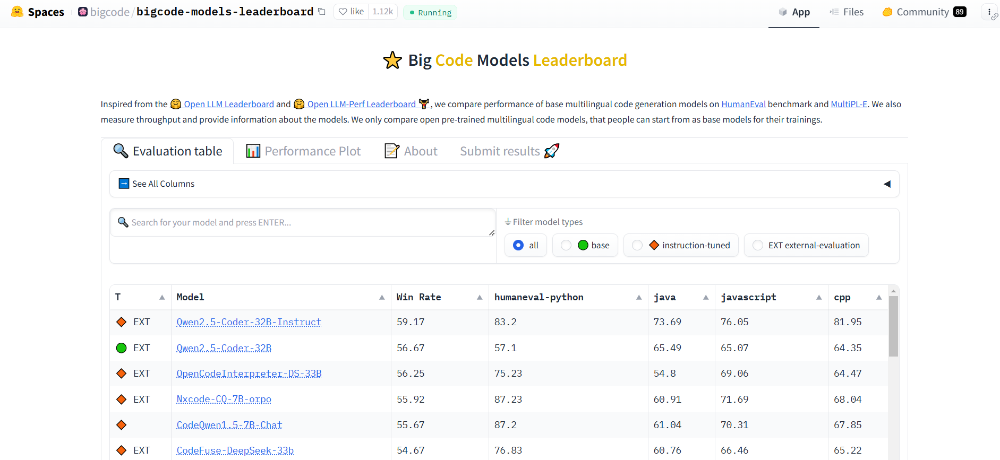
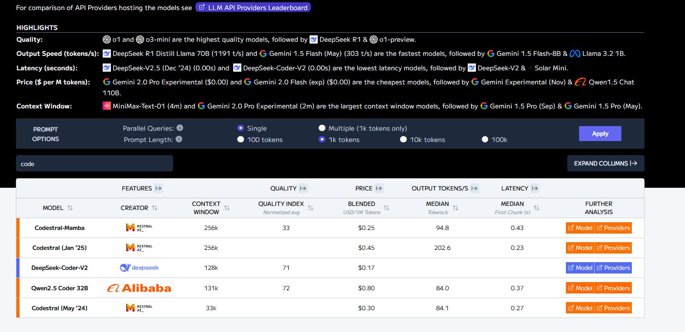

# SQL Agent with LangChain

## Data

The data used is from kaggle. You can find the same dataset [here](https://www.kaggle.com/datasets/fayez1/inventory-management)

## Technologies
* python
* [uv](https://docs.astral.sh/uv/)
* [langchain](https://python.langchain.com/docs/tutorials/sql_qa/#execute-sql-query)
* [ollama](https://ollama.com/library/qwen2.5-coder)
* [sqlite](https://database.guide/category/dbms/rdbms/sqlite/)

## Models
* [qwen2.5-coder](https://ollama.com/library/qwen2.5-coder)

## Leaderboard

## 1. [Hugging face big code models leaderboard](https://huggingface.co/spaces/bigcode/bigcode-models-leaderboard)

## 2. [artificialanalysis models leaderboard](https://artificialanalysis.ai/leaderboards/models)

